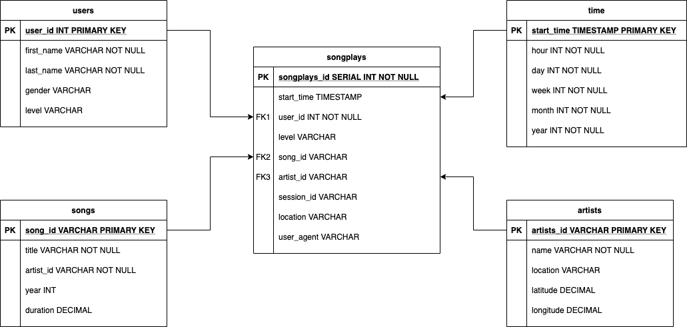
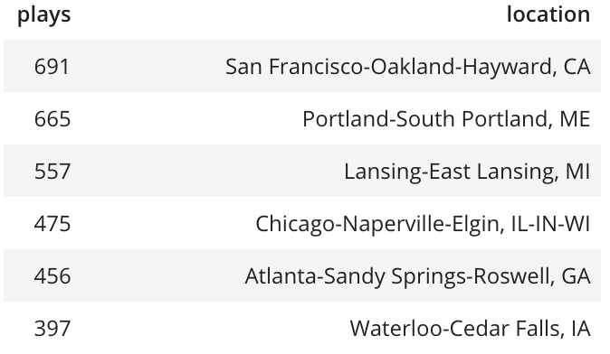

# Data Modeling with Postgres

## Introduction

Example project to practice concepts about data modeling with postgres.

## Problem definition

A startup called Sparkify wants to analyze the data they've been collecting on songs and user activity on their new music streaming app. The analytics team is particularly interested in understanding what songs users are listening to. Currently, they don't have an easy way to query their data, which resides in a directory of JSON logs on user activity on the app, as well as a directory with JSON metadata on the songs in their app.

## Solution

### Motivation

A start schema is created to contain all the required data coming in from the Sparkify logs and song metadata files.

The data warehouse will provide a unified place for all the analytical queries regarding song play analysis.

Some of the benefits of a data warehouse are:

- Reduces runtime of analytical queries, due to the fact that it removes the requirement of having to go to different places to gather the data.
- Data is stored in a denormalized way, which reduces the amount of joins that are required.

### Justification

The final goal of the analytics team of Sparkify is to be able to perform queries that provide insight into how their music streaming app is being utilized. For this, several key points can be determined:

- Data about the songs available
- Data about the artists of the songs
- Data about the users of the app
- Data about how the users interact with the app

The previous points provide the foundation for how the schema will look. Using these key points, the following is the derived start schema to be used in the project:

- The fact table is called `songplays`. This table stores the main data regarding user's interactions with the app. Every time a user plays a song, it will be stored as a record in the table. Information stored: `songplays_id, start_time, user_id, song_id, level, artist_id, session_id, location, user_agent`
- There are four dimensional tables:
  1. `songs` stores the data about songs. The columns are: `song_id, title, artist_id, duration`
  2. `artists` stores the data about artists. The columns are: `artist_id, name, location, latitute, longitude`
  3. `users` stores the data about users. The columns are: `user_id, first_name, last_name, gender, level`
  4. `time` breaksdown the start_time timestamp in the `songplays` table to prevent having to perform expensive timestamp operations in the column at query time. Columns: `start_time, hour, day, week, month, year, weekday`

Here is the entity relational diagram:



The data to be used in the project comes from different log files. The following are examples of the format of the files:

- Song metadata files:

```python
{"num_songs": 1, "artist_id": "ARJIE2Y1187B994AB7", "artist_latitude": null, "artist_longitude": null, "artist_location": "", "artist_name": "Line Renaud", "song_id": "SOUPIRU12A6D4FA1E1", "title": "Der Kleine Dompfaff", "duration": 152.92036, "year": 0}
```

- Logs of data:
  

They can be found in their raw form, which can be considered the data lake of the project. In order to use them, they needs to be read and transformed before their data can be stored in the database. Due to the benefits stated above, of having all the data in a centralized place, an ETL pipeline is created to perform the following operations:

- Read the files
- Remove unnecessary data, for example the year field in the song metadata files.
- Perform data transformations on several fields. For example transforming the `ts` field to a timestamp that can be stored in the database.
- Associate song and artist data with the user events that are recorded in the log files.

**Important to note that the Postgres COPY command is used to bulk insert the files into the db after they have been processed by the ETL pipeline. During the use of the COPY command an issue was found. If the insert is performed with the clause `ON CONFLICT DO UPDATE`, the database does not allow for the same record to be updated multiple times during the same command. That is the reason why the UPSERT is not used and instead `ON CONFLICT DO NOTHING` was adopted.**

### Example queries

A few useful queries that were used to create the dashboard for the project are:

What locations use the app the most. Number of songs played by location

```sql
SELECT COUNT(songplay_id) plays, location FROM songplays GROUP BY location ORDER BY plays DESC
```

Which returns the following:


Number of songs played by free vs paid users

```sql
SELECT COUNT(*) plays, level FROM songplays GROUP BY level
```

For the dataset used in the project the query yields the following:
|plays|level|
|:----|:----|
|1229|free|
|5591|paid|

### Technologies

The solution is implemented in a series of python scripts.

- `create_tables.py`: creates the database and the schema.
- `etl.py`: reads the logs and metadata files and transforms them into suitable format for inseting in the database. In the case of this project, as mentioned before, the postgres `COPY` command is used to bulk insert the records. After a log file is processed, it results in a pandas data frame which is saved to a csv file that is then processed by the database, creating all necessary records from the file, instead of inserting each record individually.
- `sql_queries.py`: contains the definition of DDL and DML queries used to create the tables, insert the records and query the data.

As well as a series of python notebooks to display better how how the ETL process works and the results of it.

- `etl.ipynb`: step by step description of the ETL pipeline using the methods of `etl.py` and the queries of `sql_queries.py`
- `dashboard.ipynb`: interactive analytical queries that display the results of the ETL process.

### Launch

Python version 3 or later needs to be installed.

To run the project the following commands should be run in order:

1. Run the `create_tables.py`
2. Run the `etl.py`

For the notebooks, a jupyter server is required to execute them.
